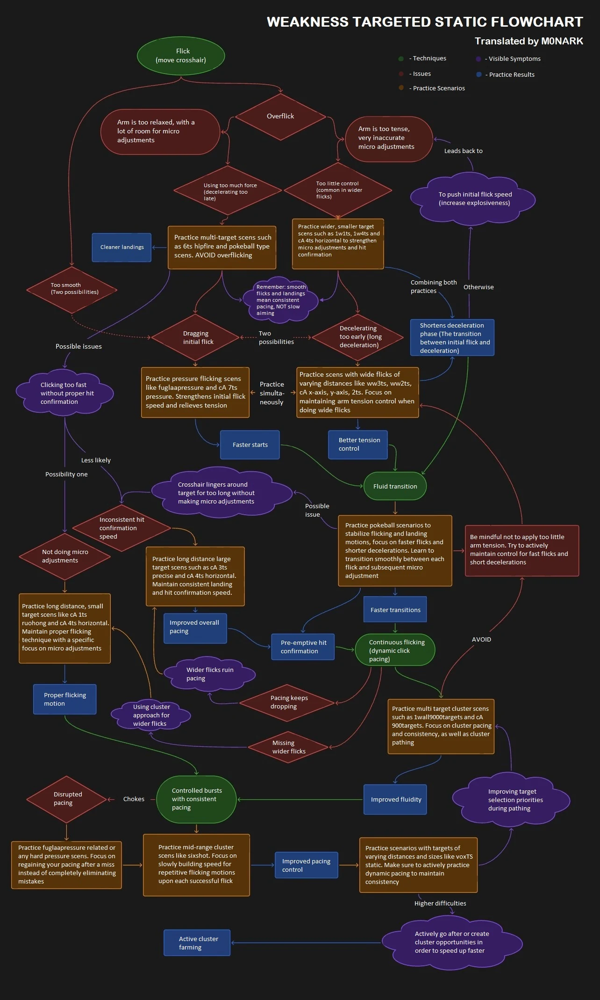

!!! info "Written by Bassel Bakr"
    Written from my own training and experience, not assembled from published sources. Treat it
    as one informed opinion rather than settled fact.

There is a flowchart that circulates in aim communities. You enter it with something you can see
yourself doing, follow the arrows, and come out holding a scenario to play.

It has forty-eight nodes. Each one names a movement, and a still box cannot show a movement. So
every node is drawn here as an animation. Point at one and it plays.

The chart tells you what to do. This page shows you what it means. Below is what I think it gets
right, and the one branch I do not follow.

- **It asks the right first question.** Not what you score. What the crosshair does.
- **One symptom can have several causes.** Overshooting is its own example.
- **Scenario names change. Shapes do not.** The drawings show shapes, not names.
- **One branch goes against a page here that has sources.** I say which, and why.

<figure class="aim-figure">

<figcaption>Point at a node to see it move. Weakness targeted static flowchart, posted by <a href="https://x.com/m0_nark/status/1905578974505251059">M0NARK</a> in March 2025, who presents it as his translation of a Chinese original. <a href="https://x.com/0jizu/status/1905702604434526654">jizu</a> was circulating that original a month earlier and credits it to violat3, whose account no longer exists. No licence stated. Reproduced with its source credited, and not under this site's CC BY-SA 4.0 licence.</figcaption>
</figure>

Putting it here does not mean I agree with all of it. Treat it as a map, not as orders.

The image itself is untouched. Invisible buttons sit on top, one over each node's text, measured
from the image rather than placed by hand.

Hover previews, a click pins so the pointer can leave, and Escape unpins. Tab reaches every node,
and Enter opens one.

## How to read this page

The chart uses five kinds of node: a technique, a problem, something you notice, a scenario to
play, and a result to expect. Each kind is drawn the same way every time.

<figure class="aim-figure">
<!-- aim:figure route -->
<figcaption>One walk through the chart, from something you saw to something you play. Five kinds of
node, each a different shape.</figcaption>
</figure>

The drawings name no scenarios, on purpose. The people who make them rename them and take them
down. A name stuck inside a drawing is the first thing to go out of date.

The shape lasts longer. One wall or many. One target or a cluster. Small and far, or big and close.
Read the shape, then find anything in your trainer that matches it.

## Side by side

Point at a node and you get that node on its own. Some things only show up when you watch two at
once, side by side. That is what these two drawings are for.

You start from something you saw yourself do, not from a score. Three movements are worth telling
apart. A crosshair that flies past the target. One that crawls the last bit. One that shoots before
it has stopped.

<figure class="aim-figure">
<!-- aim:figure symptoms -->
<figcaption>The three, side by side on one clock. Same target, same distance, and the difference is
the shape of the motion rather than its speed.</figcaption>
</figure>

The chart's best idea is that overshooting is not one problem. It splits an overflick two ways: an
arm that is too tense, and one that is too loose. The two lead to opposite drills.

A score cannot tell you which one you are doing. Neither can one node on its own. Two players miss
the same way and need opposite fixes.

<figure class="aim-figure">
<!-- aim:figure overflick -->
<figcaption>A tense arm sails past, a loose one never arrives, and a balanced one lands and stops.
The bar under each lane is what the correction cost.</figcaption>
</figure>

## The branch I do not follow

The chart routes a relaxed arm to overflicking. This site's own page on tension says the opposite,
and cites a source for it. A loose grip lags behind the target rather than sailing past it.

I go with the page. A loose arm gives me a late, dragging flick, and that needs a different fix
from a tense overshoot.

The chart's answer here is to tense up more. That has never worked for me.

I usually notice it afterwards. If my hand aches an hour into a session, I was holding tension I did
not need. A loose arm does not leave my hand aching.

<figure class="aim-figure">
<!-- aim:figure dragflick -->
<figcaption>A flick still travelling when the shot goes. The faster the hand is moving at the click,
the further the shot lands from where it was aimed.</figcaption>
</figure>

## What the chart cannot show

A flowchart gives one cause per problem. It has to, because an arrow only points one way. Most
misses have more than one cause.

When I end up with two, I try the easier one first. The cheap fix often helps the hard problem
anyway. If it does not, at least I have ruled it out.

The blue nodes name a result and stop. Cleaner landings, faster starts, less wasted movement.
Watching one happen looks like a group of shots tightening, not a number going up.

<figure class="aim-figure">
<!-- aim:figure grouping -->
<figcaption>Two runs placing the same number of shots. The ring tracks the spread as they land, and
only closes on one of them.</figcaption>
</figure>

A diagnosis goes out of date too. Fix the overflicking, keep drilling it for another month, and you
are training a problem you no longer have.

## Further resources

- [Static clicking](../wiki/categories/clicking.md): what a clean flick is, and why correcting onto
  the target is not the same thing.
- [Tension management](../wiki/fundamentals/tension-management.md): the tight and loose split this
  article disagrees with.
- [Health](../wiki/training/health.md): pain as a signal to scale back, which is where an aching
  hand belongs.
- [Designing around a weakness](../wiki/making-scenarios/designing-around-a-weakness.md): building a
  scenario once you know what to train.
- [The metronome method](metronome-method.md): pacing, which this article leaves alone on purpose.
- [Guides](../wiki/resources/guides.md#clicking): the chart itself, and other static clicking guides.
